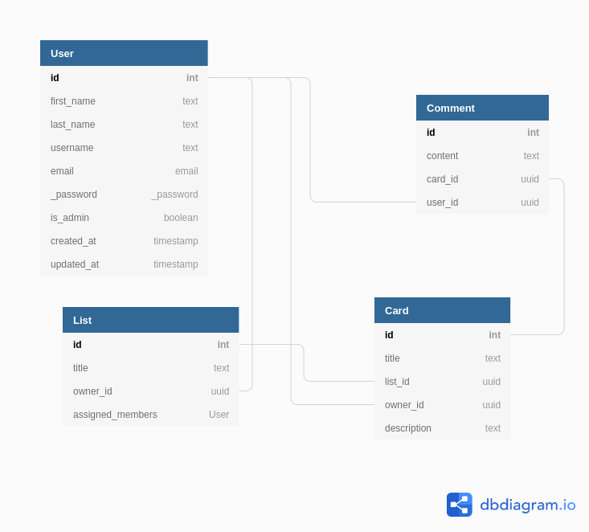

# Flask APP API

Python/Flask Backend Task by Irithm

# Requirements
```bash
- [Docker][docker]
- [Python][python] (>= 3.7)
```

## Installation

Use this command at the project to install the dependencies and start up the project

```bash
./up.sh
```

## Usage

Run app
```
./up.sh
```

Stop app
```
./down.sh
```

Print logs
```
./logs.sh
```

Run all tests
```
pytest
```

## Open Endpoints

Open endpoints require no Authentication.

* User Login: `POST /api/auth/`
* User Registation: `POST /api/auth/registration/`

## Endpoints that require Authentication

Closed endpoints require a valid Token to be included in the header of the
request. A Token can be acquired from the Login view above.

['GET', 'POST', 'DELETE', 'PATCH']
* `/api/list/`
* `/api/cards/`
* `/api/comments/`
* `/api/users/`

## ERD Diagram
Models and relationship


## Project Structure
```sh
├── config.py
├── conftest.py
├── README.md
├── docker-compose.py
├── docker-entrypoint.sh
├── Dockerfile
├── down.sh
├── up.sh
├── log.sh
├── manage.py
├── Pipfile
├── Pipfile.lock
├── app
│   ├── models
│   │   ├── mixins
│   │   ├── __init__.py
│   │   ├── base.py
│   │   ├── card.py
│   │   ├── comment.py
│   │   ├── list.py
│   │   └── user.py
│   ├── resources
│   │   ├── auth.py
│   │   ├── __init__.py
│   │   ├── base.py
│   │   ├── card.py
│   │   ├── password.py
│   │   ├── register.py
│   │   ├── comment.py
│   │   ├── list.py
│   │   └── user.py
│   └── __init__.py
|
└── migrations
    ├── migrations
    │   └── * migration files *
    ├── alembic.ini
    ├── env.py
    └── script.py.mako
```


## What's next? (Future Improvements)

```sh
* Improve permissions and roles
* Add more tests for the resources
```